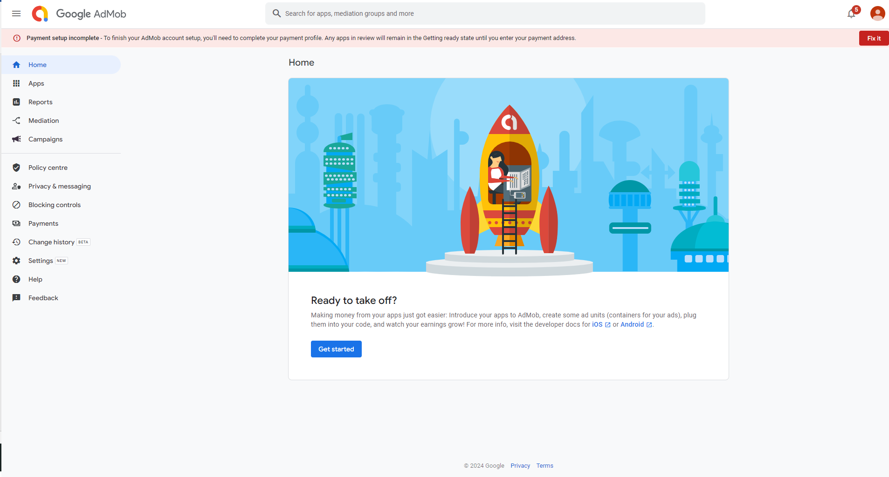

 # Adding AdMob ads to a Flutter app

## Step 1: Set Up AdMob Account
Go to the AdMob website and sign in with your Google account.
Create a new AdMob account if  don't have one.
Once logged in, create an AdMob ad unit for the app.

## Step 2: Add AdMob Plugin to Your Flutter Project
Open your pubspec.yaml file and add the AdMob plugin. Make sure to check the latest version on pub.dev.

```yaml
dependencies:
  firebase_admob: ^latest_version
```
Run `flutter pub get` to install the plugin.

## Step 3: Configure AdMob in Your App
Initialize AdMob in your app, typically in the `main.dart` file or the file where your app starts.

``` dart
import 'package:firebase_admob/firebase_admob.dart';

void main() {
  WidgetsFlutterBinding.ensureInitialized();
  FirebaseAdMob.instance.initialize(appId: 'your_app_id');
  runApp(MyApp());
}
```

## Step 4: Display AdMob Banner Ad
Create a widget to display the banner ad.

```dart
import 'package:firebase_admob/firebase_admob.dart';

class BannerAdWidget extends StatelessWidget {
  @override
  Widget build(BuildContext context) {
    return AdWidget(ad: AdManager().createBannerAd()..load());
  }
}
```
Create an AdManager class to handle ad loading and displaying.

```dart
class AdManager {
  BannerAd createBannerAd() {
    return BannerAd(
      adUnitId: 'your_banner_ad_unit_id',
      size: AdSize.banner,
    );
  }
```

## Step 5: Show Ads in Your App
Add the `BannerAdWidget` to your app where you want to display the ad.


